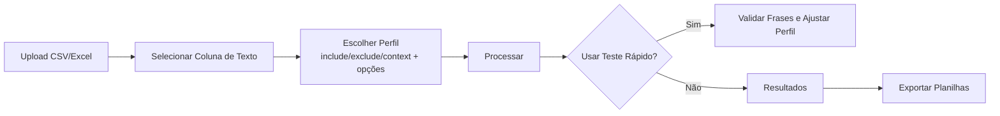
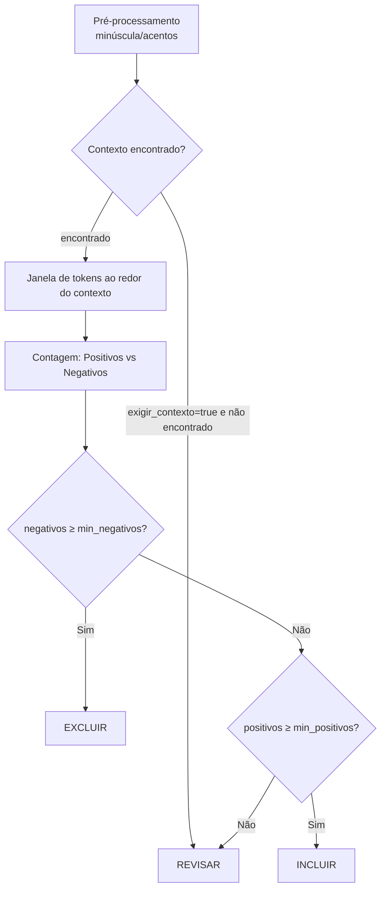

# FILTRO_AVANCADO — Advanced, Configurable Text Filtering (Streamlit App)

[](https://filtro-avancado.streamlit.app)
[](https://www.python.org/downloads)
[](https://github.com/GuimaraesL/filtro_avancado_geral/blob/master/LICENSE)

> **Filtro Avançado** é um app em **Streamlit** para **filtragem inteligente e configurável** de bases de texto (CSV/Excel). Você cria **perfis** com termos **positivos**/**negativos** e **contexto**; o motor analisa uma **janela de tokens** (proximidade) ao redor do contexto e classifica cada registro em **INCLUIR**, **REVISAR** ou **EXCLUIR**. É possível testar rapidamente e exportar resultados limpos para análise.

---

## 🧭 Sumário
- [Visão Geral](#-visão-geral)
- [Principais Recursos](#-principais-recursos)
- [Como Funciona (decisão do motor)](#-como-funciona-decisão-do-motor)
- [Opções do Perfil](#-opções-do-perfil)
- [Exemplo Real](#-exemplo-real)
- [Comece Agora](#-comece-agora)
  - [Usar no Navegador (Deploy Streamlit)](#usar-no-navegador-deploy-streamlit)
  - [Instalar e Rodar Localmente](#-instalar-e-rodar-localmente)
- [Estrutura do Projeto](#-estrutura-do-projeto)
- [Fluxos (Mermaid)](#-fluxos-mermaid)
- [Boas Práticas de Configuração](#-boas-práticas-de-configuração)
- [Exportação](#-exportação)
- [Perguntas Frequentes](#-perguntas-frequentes)
- [Roadmap](#-roadmap)
- [Contribuindo](#-contribuindo)
- [Licença](#-licença)

---

## 🔎 Visão Geral

O **Filtro Avançado** acelera a análise de **registros textuais** (manutenção, incidentes, qualidade, suporte etc.).  
Em vez de fórmulas complexas, você define **perfis** com:
- **include** (positivos),
- **exclude** (negativos),
- **context** (âncora do cenário),

e configura **como** o motor conta **palavras positivas/negativas por proximidade** (janela de tokens) para decidir entre **INCLUIR**, **REVISAR** ou **EXCLUIR**.

---

## 🚀 Principais Recursos

- **UI em Streamlit**: suba CSV/Excel, selecione a coluna de texto e rode.  
- **Perfis configuráveis**: listas de **include/exclude/context** + opções **minúscula/acentos/exigir_contexto/janela_token/min_positivos/min_negativos**.  
- **Contexto como âncora**: a janela de tokens abre **ao redor do contexto** para contar sinais positivos/negativos.  
- **Teste Rápido**: um **atalho opcional** para validar frases e ajustar o perfil com agilidade.  
- **Resultados claros**: separação por **INCLUIR/REVISAR/EXCLUIR**, contagens e amostras explicáveis.  
- **Exportação**: planilhas prontas para auditoria, BI e reporte.  
- **Reprodutível**: perfis podem ser exportados (YAML) e versionados.

---

## 🧠 Como Funciona (decisão do motor)

1. **Pré-processamento**  
   Aplica as normalizações do perfil: **minúscula** (casefold) e **acentos** (ex.: “pressão” ≈ “pressao”).

2. **Contexto (âncora)**  
   - Se **exigir_contexto = true**, é necessário encontrar **≥ 1** termo de `context` no texto para que **INCLUIR** seja possível.  
   - Mesmo com `exigir_contexto = false`, o **contexto** pode ser usado como **âncora** para abrir a janela de tokens.

3. **Janela de tokens (proximidade)**  
   Ao redor de cada ocorrência de **contexto**, abre-se uma janela de tamanho `janela_token`.  
   Dentro dessa janela o motor **conta**: **positivos** (termos de `include`) e **negativos** (termos de `exclude`).

4. **Regras de decisão**  
   - Se **negativos ≥ min_negativos** → **EXCLUIR**  
   - Senão, se **positivos ≥ min_positivos** → **INCLUIR**  
   - Caso contrário → **REVISAR** (ambiguidade / sinais insuficientes)

> *Alguns perfis podem definir “excludes fortes” (termos críticos) que disparem **EXCLUIR** direto.*

---

## ⚙️ Opções do Perfil

| Opção              | Tipo  | Descrição |
|--------------------|-------|-----------|
| `minuscula`        | bool  | Normaliza caixa (ignora maiúsculas/minúsculas). |
| `acentos`          | bool  | Normaliza diacríticos (ex.: “pressão” ≈ “pressao”). |
| `exigir_contexto`  | bool  | Se **true**, requer **≥ 1** termo de `context` para **INCLUIR**. |
| `janela_token`     | int   | Tamanho da janela (em tokens/palavras) ao redor do contexto usada para contagem. |
| `min_positivos`    | int   | Mínimo de **positivos** (include) na janela para **INCLUIR**. |
| `min_negativos`    | int   | Mínimo de **negativos** (exclude) na janela para **EXCLUIR**. |

**Listas do perfil:**
- `include` → **positivos** (contam a favor de INCLUIR)  
- `exclude` → **negativos** (contam a favor de EXCLUIR; alguns podem excluir direto)  
- `context` → **âncora** que abre a janela e, se exigido, habilita INCLUIR

**Exemplo (ilustrativo):**
```yaml
minuscula: true
acentos: true
exigir_contexto: true
janela_token: 8
min_positivos: 1
min_negativos: 1

include:
  - "falha no motor"
  - "vibração excessiva"
  - "queda de pressão"

exclude:
  - "teste de motor"
  - "simulação"

context:
  - "motor elétrico principal"
  - "linha de produção 3"
```

---

## 📌 Exemplo Real

- Quero **capturar** “falha no motor”.  
- **Excluir** quando for “teste de motor”.  
- **Âncorar** no “motor elétrico principal”.  
- Se houver **simulação** perto do contexto, **não** devo incluir direto.

**Caso exemplar:**  
`"simulação de falha no motor1"` → **REVISAR** (ambiguidade no entorno do contexto).

---

## ✳️ Comece Agora

### Usar no Navegador (Deploy Streamlit)
Abra: **https://filtro-avancado.streamlit.app**  
> Faça upload da planilha, selecione a coluna de texto, escolha o perfil e rode. O **Teste Rápido** é um **atalho opcional** para ajustar o perfil mais depressa.

### Instalar e Rodar Localmente
Requisitos: **Python 3.10+** (64-bit), `pip`, `venv`.
```bash
git clone https://github.com/GuimaraesL/filtro_avancado_geral.git
cd FILTRO_AVANCADO

python -m venv .venv
# Windows
.venv\Scriptsctivate
# macOS/Linux
source .venv/bin/activate

pip install -U pip
pip install -r requirements.txt

streamlit run advanced_filter/ui_streamlit.py
# ou use o Run.bat do projeto
```

---

## 🗂 Estrutura do Projeto

```
FILTRO_AVANCADO/
├─ advanced_filter/
│  ├─ engine/                 # Lógica de filtragem (normalização, janela de tokens, decisão)
│  ├─ data/                   # Exemplos e assets
│  ├─ ui_streamlit.py         # Interface Streamlit
│  ├─ config/                 # Perfis salvos (YAML exportados)
│  └─ utils/                  # Funções auxiliares
├─ tests/                     # Testes unitários
├─ requirements.txt
├─ pyproject.toml / setup.cfg
└─ README.md
```

---

## 📊 Fluxos (Mermaid)

### Fluxo de Alto Nível


### Decisão do Motor (com janela de tokens)


---

## ✅ Boas Práticas de Configuração

- **Especifique contexto** para reduzir falsos positivos (ex.: “motor elétrico principal”).  
- **Ajuste a janela** (`janela_token`) conforme a densidade de termos no seu texto.  
- **Calibre mínimos** (`min_positivos`/`min_negativos`) para o seu caso; aumente se houver ruído, reduza se estiver perdendo casos bons.  
- **Inclua variações frequentes** no include/exclude (com ou sem acentos, siglas, pluralizações).  
- **Use o Teste Rápido** como **atalho** para iterar mais rápido nos ajustes (opcional).

---

## 📤 Exportação

A guia **Resultados** disponibiliza, conforme o perfil e a execução:
- **INCLUIR**: registros com sinais positivos suficientes.  
- **REVISAR**: casos ambíguos/limítrofes (para auditoria).  
- **EXCLUIR**: registros com sinais negativos suficientes (ou excludes fortes).  
- **Logs/Auditoria** (quando habilitado): explicações de quais termos & janelas motivaram a decisão.

---

## ❓ Perguntas Frequentes

**1) Preciso criar arquivo YAML manualmente?**  
Não. Você cria/perfila **no app** (guia **Perfis**) e pode **exportar** para `.yaml` (útil para versionar/compartilhar).

**2) Tokens são liga/desliga?**  
Não. “Tokens” se referem à **janela de proximidade** definida por `janela_token`, onde o motor **conta** positivos (`include`) e negativos (`exclude`). Você controla **tamanho da janela** e **mínimos** (`min_positivos`/`min_negativos`).

**3) E os acentos e maiúsculas?**  
O perfil define isso: **minúscula** ignora caixa; **acentos** normaliza diacríticos (ex.: “pressão” ~ “pressao”).

**4) Por que “simulação de falha no motor1” cai em REVISAR?**  
Porque, embora haja sinal positivo (“falha no motor”), o **entorno** contém “simulação” próximo ao **contexto**, gerando **ambiguidade**; não atinge critérios claros de incluir nem de excluir.

**5) Posso usar o mesmo perfil em planilhas diferentes?**  
Sim, desde que a lógica faça sentido para o novo conjunto. Perfis por área/equipamento costumam ser mais precisos.

---

## 🗺 Roadmap

- [ ] Perfis com “excludes fortes” configuráveis via UI.  
- [ ] Painel de métricas (tendências, KPIs).  
- [ ] Execução em lote (vários arquivos).  
- [ ] Exportação adicional (JSON/Parquet).  
- [ ] Regras avançadas (regex, stemming/sinônimos).

---

## 🤝 Contribuindo

- Leia o [README do repositório](https://github.com/GuimaraesL/filtro_avancado_geral).  
- Abra uma **issue** com sua sugestão/bug.  
- Envie um **PR** com melhorias e testes.

---

## 📄 Licença

MIT License — veja `LICENSE`.

---

### 💡 Dúvidas?
- Deploy: **https://filtro-avancado.streamlit.app**  
- Contato: **autguim@outlook.com**
