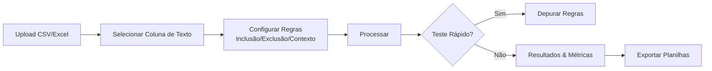
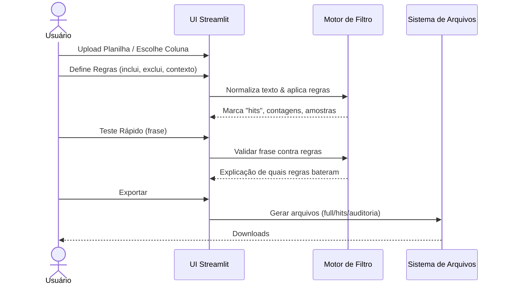
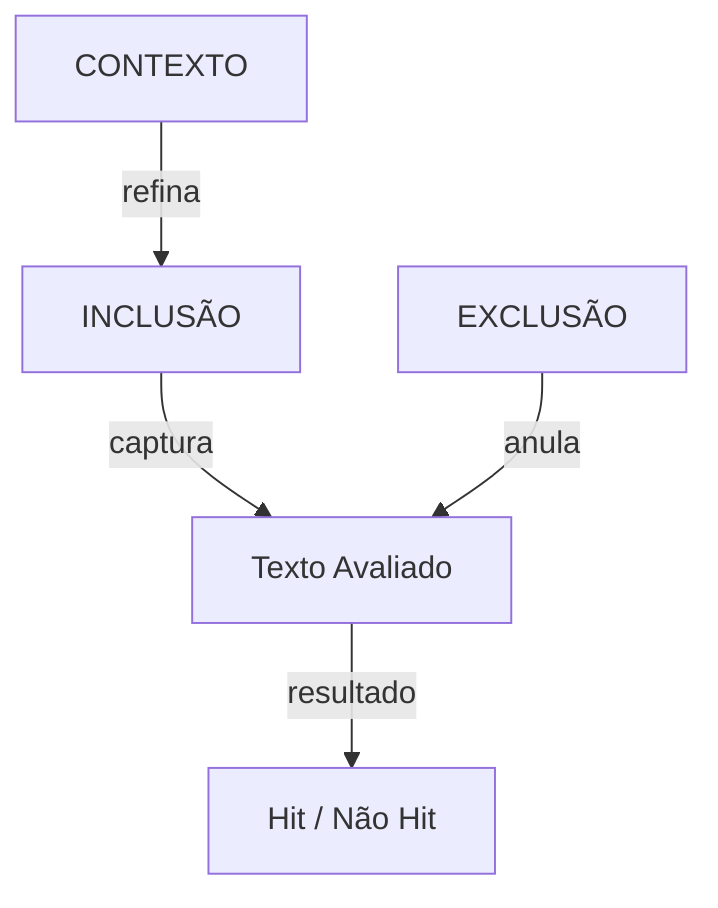

# FILTRO_AVANCADO — Advanced, Configurable Text Filtering (Streamlit App)

[](https://filtro-avancado.streamlit.app)
[](#)
[](#)

> **Filtro Avançado** é um aplicativo em **Streamlit** para **filtragem inteligente e configurável** de bases de texto (planilhas CSV/Excel). Ele permite criar **regras flexíveis** de inclusão/expulsão por palavras-chave, contextos e exceções (anti-padrões), testá-las rapidamente e **exportar os resultados** em planilhas limpas para análise e reporte.

---

## 🧭 Sumário
- [Visão Geral](#-visão-geral)
- [Principais Recursos](#-principais-recursos)
- [Como Funciona](#-como-funciona)
- [Exemplo Real](#-exemplo-real)
- [Comece Agora](#-comece-agora)
  - [Usar no Navegador (Deploy Streamlit)](#usar-no-navegador-deploy-streamlit)
  - [Instalar e Rodar Localmente](#-instalar-e-rodar-localmente)
- [Estrutura do Projeto](#-estrutura-do-projeto)
- [Gráficos Mermaid](#-gráficos-mermaid)
- [Boas Práticas de Configuração](#-boas-práticas-de-configuração)
- [Exportação e Relatórios](#-exportação-e-relatórios)
- [Perguntas Frequentes](#-perguntas-frequentes)
- [Roadmap](#-roadmap)
- [Contribuindo](#-contribuindo)
- [Licença](#-licença)

---

## 🔎 Visão Geral

O **Filtro Avançado** nasceu para acelerar a análise de **registros textuais** (ex.: ocorrências, relatórios, logs, descrições de incidentes, pedidos de manutenção).  
Em vez de fórmulas complexas, você define **regras de filtragem** (palavras, frases, stems, *wildcards*, e **exceções**) e acompanha **em tempo real** os resultados: contagens, amostras e planilhas para download.

---

## 🚀 Principais Recursos

- **Interface intuitiva em Streamlit**: carregue CSV/Excel e configure tudo pela UI.  
- **Regras flexíveis**: listas de termos de **INCLUSÃO** e **EXCLUSÃO** (anti-padrões), com suporte a variações e pluralizações.  
- **Contexto**: combine termos para reduzir falsos positivos (ex.: “luva” **e** “EPI”).  
- **Teste Rápido**: escreva uma frase e veja se/por que ela “bate” nas regras.  
- **Execução guiada**: botões claros, guia de **Resultados** e arquivos prontos para baixar.  
- **Exportação**: resultados segmentados (full, hits, não-hits, auditoria).  
- **Performance**: processamento vetorizado com pandas e *caching* inteligente.  
- **Reprodutível**: regras salvas e reutilizáveis (YAML/JSON).  

---

## 🧠 Como Funciona

1. **Ingestão**: você carrega um CSV/Excel e escolhe a coluna de texto alvo.  
2. **Configuração**: define regras de **inclusão**, **exclusão**, e **contextos** opcionais.  
3. **Processamento**: o motor aplica normalização (minúsculas, *strip*, remoção de ruído opcional), avalia regras e marca *hits*.  
4. **Validação**: use o **Teste Rápido** para checar frases e depurar regras.  
5. **Resultados**: visualize contagens, amostras e baixe as planilhas finais.  

> A lógica foca em **clareza e auditabilidade**. Cada registro filtrado pode ser explicado por qual regra o capturou (quando auditoria está ativa).

---

## 📌 Exemplo Real

Imagine que você tem um arquivo com registros de incidentes em uma fábrica, contendo uma coluna de descrição textual.  
Você pode aplicar o **Filtro Avançado** para identificar registros que contenham **palavras-chave críticas** como:

- "queda"  
- "choque elétrico"  
- "vazamento"  
- "incêndio"  

E ao mesmo tempo evitar falsos positivos:  

- Incluir "luva" ou "mãos", **mas excluir** "contramão".  
- Marcar como **hit** apenas quando "luva" aparecer **junto** de "EPI".  

Resultado: um novo Excel somente com as ocorrências relevantes para investigação e relatórios.

---

## ✳️ Comece Agora

### Usar no Navegador (Deploy Streamlit)

Abra a aplicação: **[https://filtro-avancado.streamlit.app](https://filtro-avancado.streamlit.app)**  
> Não precisa instalar nada. Faça upload da planilha, configure as regras e exporte os resultados.

### Instalar e Rodar Localmente

**Requisitos**: Python 3.10+ (64-bit recomendado), `pip` e virtualenv.  

```bash
# 1) Clone o repositório
git clone https://github.com/SEU_USUARIO/FILTRO_AVANCADO.git
cd FILTRO_AVANCADO

# 2) Crie e ative um ambiente virtual
python -m venv .venv
# Windows
.venv\Scripts\activate
# macOS/Linux
source .venv/bin/activate

# 3) Instale as dependências
pip install -U pip
pip install -r requirements.txt

# 4) Rode o app Streamlit
streamlit run advanced_filter/ui_streamlit.py
```

---

## 🗂 Estrutura do Projeto

```
FILTRO_AVANCADO/
├─ advanced_filter/
│  ├─ engine/                 # Lógica de filtragem (normalização, matching, contexto, auditoria)
│  ├─ data/                   # Exemplos e assets
│  ├─ ui_streamlit.py         # Interface Streamlit
│  ├─ config/                 # Regras salvas (YAML/JSON)
│  └─ utils/                  # Funções auxiliares
├─ tests/                     # Testes unitários
├─ requirements.txt
├─ pyproject.toml / setup.cfg # (opcional) instalação como pacote
└─ README.md
```

---

## 📊 Gráficos Mermaid

### Fluxo de Alto Nível


### Sequência de Execução


### Inclusão x Exclusão


---

## ✅ Boas Práticas de Configuração

- **Especifique exceções** para reduzir falsos positivos (ex.: capturar “mão”/“mãos” mas **excluir** “contramão”).  
- **Contexto**: combine termos (ex.: `luva` **E** `EPI`) para sinalizar ocorrências realmente relevantes.  
- **Normalização**: mantenha tudo minúsculo e sem acentos quando possível para aumentar *recall*.  
- **Teste Rápido**: sempre valide uma amostra de frases típicas antes de processar tudo.  

Exemplo YAML:
```yaml
include:
  - "mão"
  - "mãos"
  - "dedo*"
exclude:
  - "contramão"
context_any:
  - "EPI"
  - "proteção"
context_all: []
```

---

## 📤 Exportação e Relatórios

Ao finalizar o processamento, a guia **Resultados** disponibiliza:
- **Full**: base original com colunas auxiliares (marcação de *hit*, regra, etc.).  
- **Hits**: somente registros capturados.  
- **No-Hits**: registros não capturados.  
- **Auditoria**: mapeamento “registro → regra(s) que bateram)”.  

---

## ❓ Perguntas Frequentes

**1) O app roda offline?**  
Sim, localmente ele roda offline após instalar dependências.  

**2) Quais formatos de arquivo?**  
`.csv`, `.xlsx`.  

**3) Dá para salvar e reutilizar regras?**  
Sim, exporte/import YAML/JSON de regras via UI.  

**4) Como evitar falsos positivos com “luva”?**  
Use **contexto** (`luva` + `EPI`) e **exceções** (`contramão`).  

---

## 🗺 Roadmap

- [ ] Regras com expressões regulares.  
- [ ] Dicionário de sinônimos e *stemming*.  
- [ ] Modo lote (vários arquivos).  
- [ ] Painel de métricas (tendências, KPIs).  
- [ ] Exportação JSON/Parquet.  

---

## 🤝 Contribuindo

Sugestões de melhorias, correções e novas funcionalidades são bem-vindas!  
Abra uma issue ou envie um pull request no repositório oficial.  

---

## 📄 Licença

Este projeto está licenciado sob a **MIT License**.  
Veja `LICENSE` para mais detalhes.  

---

### 💡 Dúvidas?
Abra uma issue ou acesse o **[Deploy no Streamlit](https://filtro-avancado.streamlit.app)**.
